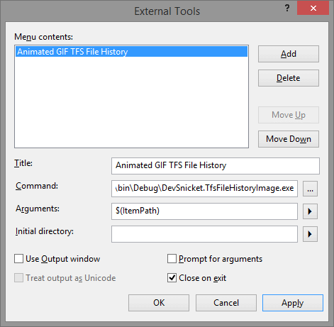

Animated GIF of a files TFS history
===================================

When working in an established code-base sometimes your forced to bear witness to a multi-thousand line file. What story could the file tell, back to when it was first added, did it gradually mutate into the beast it is today, are there imprints of any heavy footed steps and did anyone try take the reins?

It'd be easy to get downhearted, but what you might be missing are files who's recent history are the verse. A once feral file might have been tamed overtime with hard work in to an innocuous looking 200 liner which doesn't raise an eyebrow.

To help quickly visualise this I've written a console app which creates and opens an animated GIF showing each revision going forwards in time. Its parameters can be either a TFS local workspace path, or a server address and path. The former can be set up in Visual Studio as an external tool to run on the currently selected file.

The files returned from TFS are formatted using [CSharpFormat](http://www.manoli.net/csharpformat/), then rendered with a winforms [WebBrowser](http://msdn.microsoft.com/en-us/library/system.windows.forms.webbrowser(v=vs.110).aspx), the images are then processed with GDI and finally passed to [BumpKit](https://github.com/DataDink/Bumpkit) for saving to an animated GIF. That last part was the most time consuming. I first tried writing the GIF file myself. I then I tried two ways of accessing [WIC (Windows Imaging Component)](http://msdn.microsoft.com/en-gb/library/windows/desktop/ee719654(v=vs.85).aspx), but couldn't pass through either the delay or loop instruction to the encoder. BumpKit is available as a NuGet package, took three statements and even less minutes to get working.

The images below are a couple of examples. The first is a long file that has been allowed to get even longer. The second one starts out too long, but has been split up over time when there was the opportunity. They both predate a transition to TFS from SVN so you don't see back to their creation.

|reformed character|bad to worse|the gibbering wreck|careful, might be time to plan some refactoring|
|-|-|-|-|
|||||
